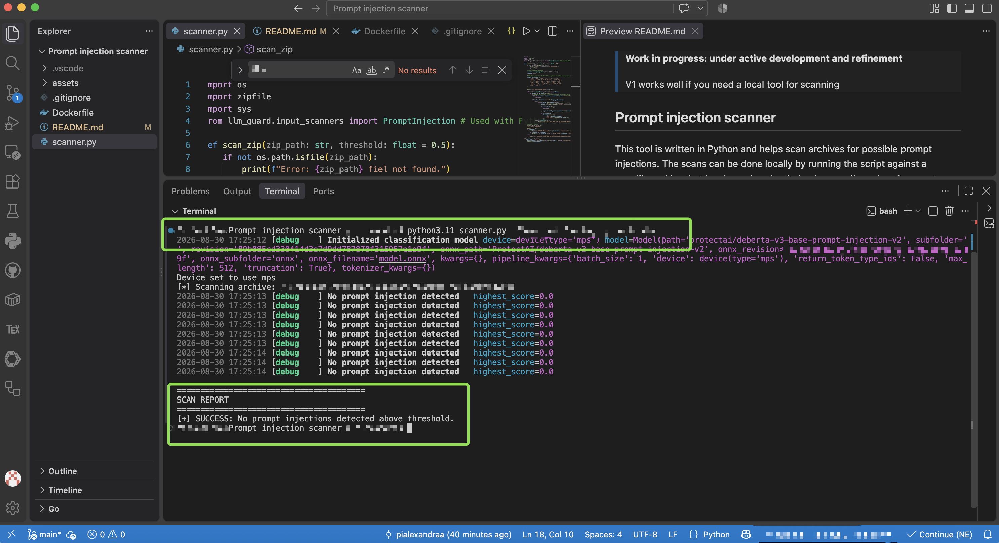
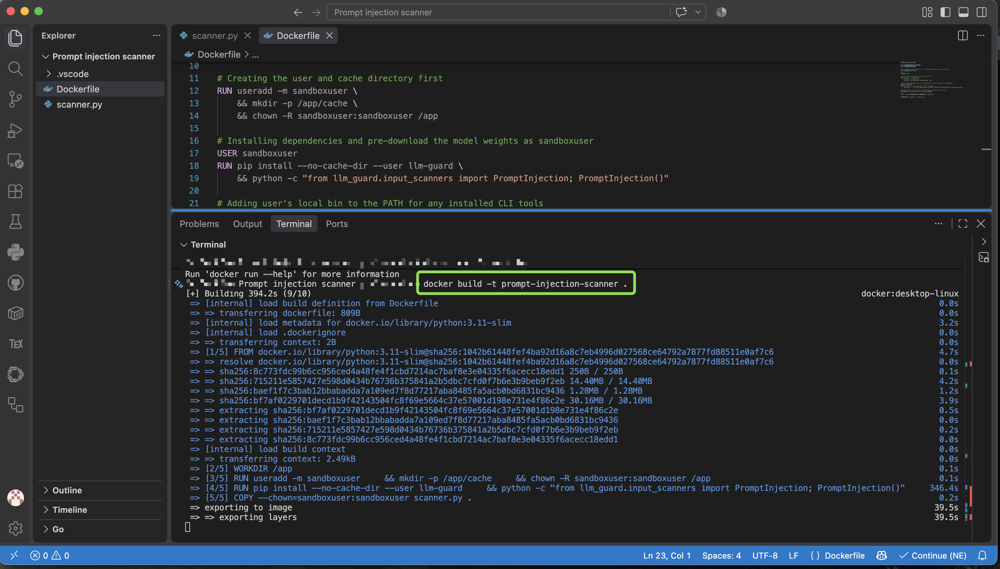
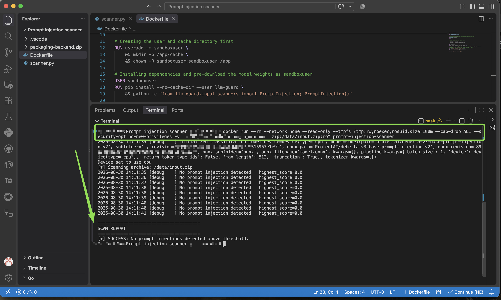

> **Work in progress: under active development and refinement**
> 
> V1 works well if you need a local tool for scanning


## Prompt injection scanner

This tool is written in Python and helps scan archives for possible prompt injections. The scans can be done locally by running the script against a specific archive that has been downloaded or in a sandboxed environment, a temporary container for extra-security.

## Motivation

Oftentimes, modern browsers and solutions come bundled in with various types of security features and checks. At times, as security checks, one could follow common sense checks like:
* comparing the hashes of the executables/programs
* using antivirus and/or firewalls
* browser extensions for minimal security checks at downloads
* enabling system security programs
* using VirusTotal for checking URLs, executables, and/or archives

However, when dealing with prompt injections, most of these scans fail. Given the recent advancement of AI tools and security breaches we've seen advertised online, it is important to prevent and keep safe from **prompt injections**. These are specifically difficult to detect because **the malicious instructions are context-based**: these are cybersecurity exploits where an attacker manipulates a large language model (LLM) by embedding hidden or deceptive instructions into the inputs.

## About the tool

1. It is simplistic and efficient. Running it locally, via python3.11

    

2. Running it via a docker container for extra security


    2.1. building the sandboxed environment

    

    2.2. running the scan in the environment

    


The **security boundary** for the container should be something standard, like:

```bash
docker run --rm --network none --read-only --tmpfs /tmp:rw,noexec,nosuid,size=100m --cap-drop ALL --security-opt no-new-privileges -v "$(pwd)/path/to/your-target-archive.zip:/data/input.zip:ro" prompt-injection-scanner
```

Isolation parameters:
| Parameter | Description |
| :--- | :--- |
| `--network none` | air-gapped environment with zero internet access |
| `--read-only` | the root filesystem is locked and cannot be modified |
| `--tmpfs /tmp` | forces all temporary data into volatile memory that vanishes upon exit |
| `--cap-drop ALL` | strips away all root and kernel-level privileges |
| `User sandboxuser` | enforces non-root, unprivileged execution (I put them directly in the Dockerfile) |


